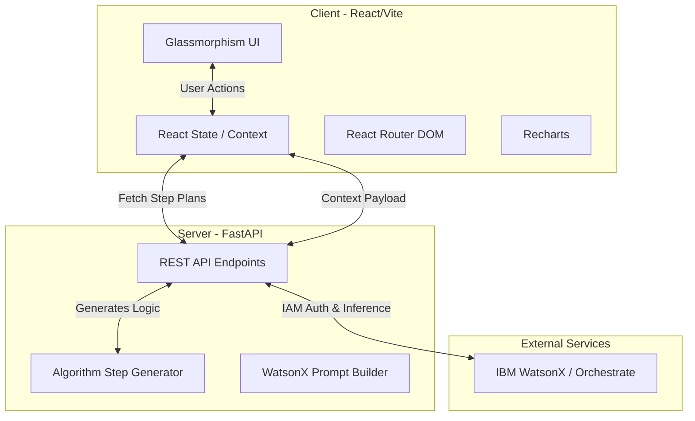

# 🧠 Algorithmic Visualizer AI

> An intelligent, context-aware educational platform designed to help computer science students master data structures and algorithms through real-time visualization, comparative benchmarking, and live AI tutoring.

[](https://algo-visualizer-ai.vercel.app/)


---

## ✨ Core Features

### 📊 1. Interactive Visualizer
Watch sorting algorithms execute step-by-step. The UI provides deep visual context:
* **Live Pseudocode:** Side-by-side pseudocode highlights the exact line executing in real-time.
* **Partition Trees:** Visualizes the divide-and-conquer splits for algorithms like Merge Sort and Quick Sort.
* **Granular Transport Controls:** Pause, play, step forward, or scrub through the algorithm timeline via a slider.

### ⏱️ 2. Comparative Benchmark
Race two algorithms against each other on the exact same dataset.
* **Real-time Analytics:** Watch live line charts track comparisons and swaps using `Recharts`.
* **Side-by-Side Execution:** Visually compare the efficiency of O(N²) vs O(N log N) algorithms simultaneously.

### 🤖 3. Elix — The AI Tutor
Powered by **IBM WatsonX**, Elix is a context-aware AI assistant integrated directly into the workspace.
* **Live Context Tracking:** Elix knows exactly what step of the algorithm you are viewing, which numbers are being compared, and where the pivots are.
* **Interactive "Quiz Me":** The AI generates on-the-fly, context-specific questions testing your understanding of the *current* step, then grades your answer.

---

## 🏗️ System Architecture

The application is decoupled into a high-performance frontend and a robust Python backend, communicating via REST APIs.


🛠️ Tech Stack

    Frontend: React.js, Vite, React Router, Recharts, Custom CSS (Glassmorphism).

    Backend: FastAPI, Python.

    AI Engine: IBM WatsonX (Watson Orchestrate API).

    Deployment: Vercel (Frontend), [Insert Backend Host] (Backend).

🚀 Supported Algorithms

Currently, the visualizer supports the mathematical step-generation and visualization for:

    O(N²): Bubble Sort, Selection Sort, Insertion Sort, Cycle Sort

    O(N log N): Merge Sort, Quick Sort, Heap Sort, 3-way Merge Sort

💻 Local Installation

To run this project locally, you will need Node.js and Python installed.
1. Frontend Setup
Bash
```
# Clone the repository
git clone [https://github.com/Whalien08/algo-visualizer-ai.git](https://github.com/Whalien08/algo-visualizer-ai.git)

# Navigate to the frontend directory
cd algo-visualizer-ai/frontend

# Install dependencies
npm install

# Start the Vite development server
npm run dev

2. Backend Setup
Bash

# Navigate to the backend directory
cd ../backend

# Create a virtual environment
python -m venv venv
source venv/bin/activate  # On Windows: venv\Scripts\activate

# Install requirements
pip install -r requirements.txt

# Set up IBM Watson credentials
# Create a .env file and add your IBM_API_KEY and IBM_PROJECT_ID

# Run the FastAPI server
uvicorn main:app --reload
```
🔮 Future Scope

    Graph Algorithms: Expanding the visualizer to include pathfinding (Dijkstra, A*) and graph traversal (BFS, DFS).

    User Authentication: Allowing students to track their quiz scores, learning progress, and benchmark histories over time.

    Multi-Language Pseudocode: Toggling pseudocode syntax between Python, Java, and C++.

Designed for structured, interactive learning.
